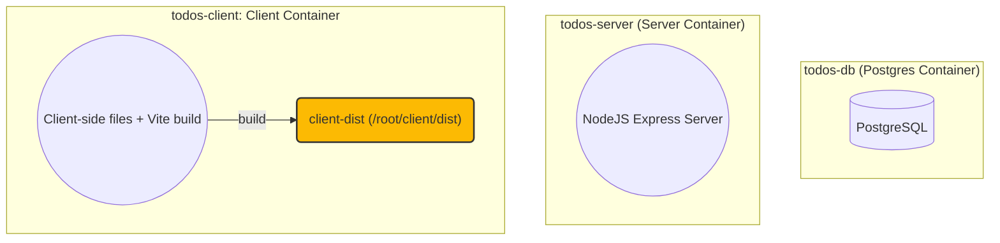
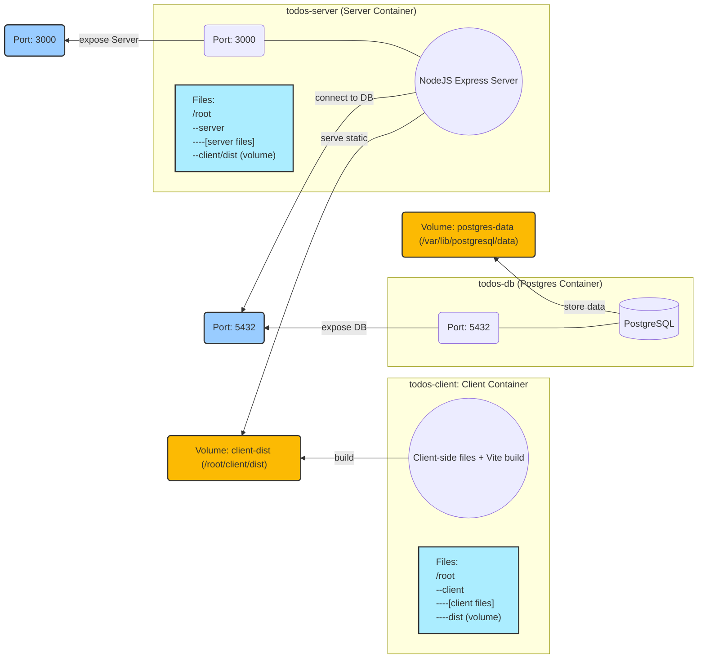

## План

1. Простое приложение Todo List
   1. запускаем в режиме разработчика
   2. запускаем в режиме продакшн
2. Какие есть проблемы?

   1. Разработка: нужно установить NodeJS, Postgres, настроить Postgres (создать БД, пользователя)
   2. Деплой (при каждом обновлении):
      1. Установить NodeJS
      2. Установить Postgres
      3. Настроить Postgres: создать БД, пользователя
      4. Скачать репо
      5. Установить зависимости в папках server и client
      6. Сделать build в папке client
      7. Запустить сервер
   3. Также протестировать продакшен-билд мы сможем только на продакашен-сервере (на локале другое окружение)
   4. Для фронтендера: для развёртывания бакенда на локальном машине нужно выполнить те же шаги, что и для деплоя

3. Чем нам поможет докер?

   1. Окружение и инструкции для сборки и запуска записываются в файлах Dockerfile и docker-compose.yml
   2. Приложение запускается в изолированной среде (одинаковом, чистом окружении на любой машине)
   3. Приложение можно собрать и запустить одной командой

4. Настраиваем докер

   1. Схема контейнеров
   2. Устанавливаем докер
   3. Пишем Dockerfile, docker-compose.yml
      1. Для клиента, запускаем, смотрим
      2. Для БД, запускаем, смотрим
         1. передаём .env
         2. volume для данных
      3. Для сервера, запускаем, смотрим
         1. передаём .env
         2. пробрасываем порты
         3. связываем клиент и сервер через volume

5. Магия: деплоим это на VPS (+make)
   1. Шаги деплоя с докером:
      1. Установить Docker
      2. Скачать репо
      3. Запустить `docker-compose up -d`
6. Зачем докер нужен фронтендеру?
   1. Возможность быстро развернуть бакенд у себя на локале
   2. Умение обернуть фроентенд в докер-контейнер и встроить в docker-compose
   3. Возможность протестировать на локальной машине как будет вести себя конечный продукт
7. Ограничения докера
   1. Требования к ОЗУ и диску:
      1. с докером: 460Мб ОЗУ, 3.1Гб диск
      2. без докера: 380Мб ОЗУ, 2.6Гб диск
8. Ещё фишки докера
   1. слои и кеширование
   2. Больше про Volumes - пишем логи в файл
   3. полезные скрипты: build, start, all-logs, app-log
   4. бэкапы, dozzle

## Docker Containers

## Docker Containers (with ports and volumes)

