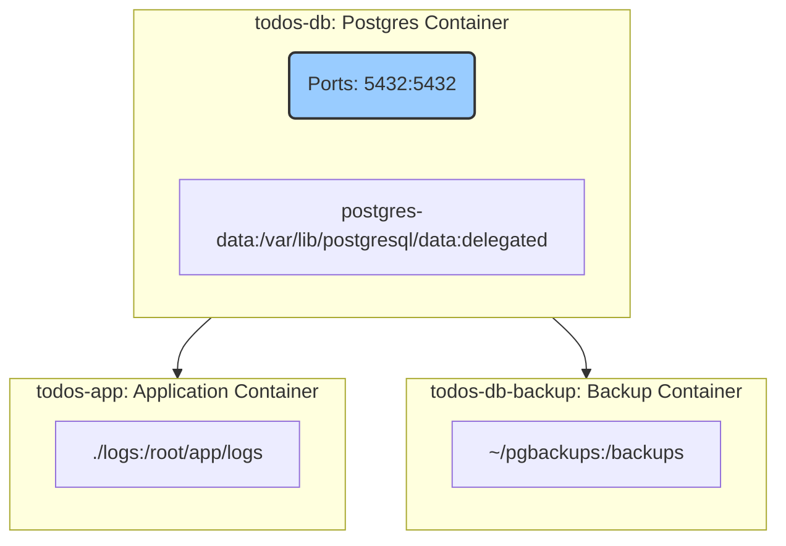

## План

1. Почему я решил использовать докер?
   1. Непонятно влияет ли моё окружение на работу приложения? (ts-node, mac vs linux)
   2. При переходе на другие версии ноды/постгреса и т.д. нужно обновлять их и на VPS
2. Собираем приложение - NodeJS + Postgres + backup
   1. Пример приложения
   2. Dockerfile
   3. docker-compose
   4. порты
   5. volumes (postgres)
3. Магия: деплоим это на VPS, make, .env
4. Ещё фишки докера
   1. слои и кеширование
   2. докер контейнер каждый раз запускается с нуля (точно? чем это хорошо?)
   3. Больше про Volumes - пишем логи в файл
   4. полезные скрипты: build, start, all-logs, app-log
   5. dozzle - логи
5. Ограничения докера
   1. Требования к ОЗУ и диску:
      1. с докером: 460Мб ОЗУ, 3.1Гб диск
      2. без докера: 380Мб ОЗУ, 2.6Гб диск
6. FAQ
   1. как получить доступ к командной строке контейнера?

## todo

- [ ] сделать инфорграфику
- [ ] расписать по шагам, что я буду делать и как переходить с темы на тему
- [ ] написать забавных тудушек
- [ ] поправить app.v0.js
- [ ] есть ли способ копировать файлы в volume при сборке контейнера?

## Без докера

1. Установить NodeJS
2. Установить Postgres
3. Настроить Postgres: создать БД, пользователя
4. Скачать репо
5. Установить зависимости в папках server и client
6. Сделать build в папке client
7. Запустить сервер

## С докером

1. Установить Docker
2. Скачать репо
3. Запустить `docker-compose up -d`

## graph

